# CFAv3 Staircase Flowchart

Cost-ordered fall-through triage ladder (staircase v1). Every stair is a **read-only**
predicate; exits dispatch specialized agents; all mutating/solver experiments live inside
exit agents behind `VALIDATION_AUTHORIZED` on a forked session. Per-stair specs:
[CFA_staircase_v1.md](CFA_staircase_v1.md). Benchmarks and stair summary: [CFAv3.md](CFAv3.md).

```mermaid
flowchart TD
    START(["/cfav3 invoked"]):::entry --> P0

    %% ── Stage 0 — session snapshot (once) ────────────────────
    subgraph P0["⚡ Stage 0 — session snapshot, once  [~20 s @100 covers / ~60 s @415]"]
        direction LR
        P0A["one-shots + session gates\nget_inst_top · get_analyze_info · get_rtl_files\nflop/constant/undriven counts · property lists\ntask -show · stopat -list · abstract -list\nget_clock_info · check_lpv -get_status\n→ HAS_STOPAT · HAS_BBOX · HAS_ABSTRACTION\nIS_POWER_AWARE · N_ASSUMES\n[~1–3 s]"]
        P0B["cfa_dump_failures all 64 1\nskip_needed_assumes=1 — NEVER pay NA here\n[~2 s]"]
        P0C["bulk per-cover, ALL failing covers:\nget_property_info 24 attrs (67 ms)\n+ 1-hop get_fanin (51 ms)\n[~120 ms/cover]"]
        P0D["lazy singletons — fetched once on demand:\nget_reset_info 3.1 s · get_defines 2.3 s\nassume-expr dump 3.7 s → assume-signal index"]
    end

    P0 --> GROUP["Group by source_file:source_line → reps\nverdict propagates to members agreeing on\n(status, engine, min_length-class)\n[no JG call]"]

    %% ── Stair 1 — setup sanity [F] ───────────────────────────
    GROUP --> ST1{"Stair 1 — setup sanity  [F]"}
    ST1 -->|"unprocessed / error / disabled\nwrong task / waived"| X1(["setup_issue  DEFINITE\n→ deterministic report — no LLM"]):::setup
    ST1 -->|"pass"| ST2

    %% ── Stair 2 — property lint [F] ──────────────────────────
    ST2{"Stair 2 — property lint  [F]"}
    ST2 -->|"always( · always s_eventually (GF)\n· literal-false conjunct"| X2(["property_semantics  DEFINITE\n→ intent-confirmation agent"]):::propflag
    ST2 -->|"plain s_eventually / disable-iff overlap\n→ annotate MEDIUM, keep descending"| ST3
    ST2 -->|"clean"| ST3

    %% ── Stair 3 — status/engine fork [F] ─────────────────────
    ST3{"Stair 3 — status/engine fork  [F]"}
    ST3 -->|"status bounded_* / undetermined\nEXITS LADDER — NA meaningless on bounded"| X3A(["bounded_depth / proof_resource\n→ bound-estimator agent"]):::bound
    ST3 -->|"engine PRE + min_length = infinite\n+ status unreachable"| ST3B
    ST3 -->|"strong-engine full unreachable\n(N/K/I/H/M/L)"| ST4

    %% ── Stair 3b — PRE terminal classification (v3.2) ────────
    %% "PRE proved it" is a MECHANISM: JG's preprocessor also folds
    %% ASSUME-pinned constants and property contradictions.
    ST3B{"Stair 3b — terminal origin of the PRE proof  (v3.2)"}
    ST3B -->|"cone ∩ assume-index ≠ ∅\n(expr tokens · 1-hop · deep-cone inputs)\n→ annotate pre_structural_assume_pinned\n(overconstraint prior)"| ST4
    ST3B -->|"pure free-input cone, no assume\n→ expression contradicts itself"| X3P(["property_semantics  HIGH\nself-contradictory SVA"]):::propflag
    ST3B -->|"driver probe: overridable parameter\n/ parameter-folded"| X4
    ST3B -->|"driver probe: localparam / literal tie\n/ generate tie-off"| X3B(["dead_code  HIGH\n→ structural agent"]):::deadcode
    ST3B -->|"relational drivers / probe inconclusive\n→ annotate pre_structural, descend"| ST4
    ST3B -->|"probe layer unavailable → legacy exit\nterminal_unconfirmed=1"| X3C(["unresolved  MEDIUM\n→ cfav3-cover-analyzer (neutral)\nno anchor — never anchor to dead_code"]):::unresolved

    %% ── Stair 4 — parameters [C] — terminal-node classified (v3.1)
    ST4{"Stair 4 — parameters  [C ~100 ms/rep]\nget_design_info -instance param + localparam\nWHY-recursion: classify the constant's ORIGIN"}
    ST4 -->|"terminal = overridable parameter\n/ parameter-folded constant"| X4(["config_mismatch  HIGH\n→ parametric-invariant agent"]):::config
    ST4 -->|"terminal = localparam / literal tie\n/ generate tie-off"| X4B(["dead_code  HIGH\n→ structural agent"]):::deadcode
    ST4 -->|"param in non-const driver\n→ annotate param_in_driver"| G5
    ST4 -->|"pass"| G5

    %% ── Stair 5 — modeling artifacts [C, session-gated] ──────
    G5{"session gate:\nHAS_STOPAT ∨ HAS_BBOX ∨ HAS_ABSTRACTION ?"}
    G5 -->|"no — stair skipped free"| ST6
    G5 -->|"yes"| ST5
    ST5{"Stair 5 — modeling artifacts  [C]\nset intersection, no new JG call"}
    ST5 -->|"1-hop cone ∩ stopat/bbox/abstraction ≠ ∅"| X5(["modeling_artifact  HIGH\n→ modeling-artifact agent\nvalidation: stopat -remove + re-prove"]):::modeling
    ST5 -->|"pass — deep re-check at Stair 7"| ST6

    %% ── Stair 6 — reset/clock/X/LPV [C + lazy S] ─────────────
    ST6{"Stair 6 — reset / clock / X / LPV  [C + lazy S]\nget_flop_info on ≤5 cone flops\ncheck_lpv -signal only if IS_POWER_AWARE"}
    ST6 -->|"reset-assume blocks cone /\nclock mismatch / gated-clk const-0 /\npower domain off"| X6(["reset_init · clock_domain · lpv_issue\n→ reset/clock/LPV agents"]):::reset
    ST6 -->|"x_sources ≠ ∅ → annotate MEDIUM"| ST7
    ST6 -->|"pass"| ST7

    %% ── Stair 7 — deep fanin BFS [capped] ────────────────────
    ST7["Stair 7 — deep fanin BFS\ndepth ≤ 200 · nodes ≤ 5000 · ~2 s wall cap/rep\nFV boundary model (v3.1): primary_input /\nfree-input nodes are STIMULUS — never dead-code\ncap-hit → keep partial cone, cone_partial=1"]
    ST7 -->|"design-INTERNAL undriven\n/ constant deep in cone"| X7(["dead_code  HIGH"]):::deadcode
    ST7 -->|"stopat / bbox deep in cone"| X5
    ST7 -->|"cone clean → full cone sharpens NA priority"| ST8

    %% ── Stair 8 — needed-assumptions oracle [E] ──────────────
    %% v3.1: annotations NEVER exit — they ride into the bundle. Every
    %% survivor gets NA until the wall budget runs out; cone ∩ assume-index
    %% is a PRIORITY score only, not a gate.
    ST8["Stair 8 — get_needed_assumptions  [E]\n12.2 s/rep — wall budget 10 min ≈ 50 reps\nEVERY survivor queried, priority order:\nsize of cone ∩ assume-signal index, desc\nlist_assumes_restricts once if ≥1 hit"]
    ST8 -->|"NA ≠ ∅  — FORMAL proof"| X8(["overconstraint  HIGH\n→ tb-overconstraint agent\nvalidation: relax-assume re-prove"]):::overcon
    ST8 -->|"NA = ∅ — formal negative:\nNOT overconstraint (v3.3: design-side\nspans DI/DC/CM/PS — neutral analyzer\ndecides; never auto-DI)"| ST9
    ST8 -->|"budget exhausted → na_skipped=1"| ST9

    %% ── Stair 9 — terminal decomposition prover ──────────────
    ST9["Stair 9 — decomposition prover  [E-heavy]\nforked session · VALIDATION_AUTHORIZED · ≤ M proves/rep\nconjunct split A,B,A&&B · prefix ladder · config probe"]
    ST9 --> X9A(["design_invariant"]):::desinv
    ST9 --> X9B(["rtl_bug\n(intended-legal behavior blocked,\nlocalized by first dead prefix rung)"]):::rtlbug
    ST9 --> X9C(["wrong_cover\n(intent mismatch)"]):::propflag
    ST9 --> X9D(["missing_config\n(hits only under forced cfg-enable)"]):::config
    ST9 --> X9E(["needs_solver\n+ full evidence ledger\n→ cfav3-cover-analyzer"]):::unresolved

    %% ── Pack / dispatch / report ─────────────────────────────
    X2 & X3A & X3B & X3C & X3P & X4 & X4B & X5 & X6 & X7 & X8 & X9A & X9B & X9C & X9D & X9E --> PACK

    PACK["📦 cfa_pack_groups.py\nbundle = evidence ledger incl. NEGATIVE results\n+ RTL files + cone + constraints\n→ groups/group_N.json"]:::pack

    PACK --> DISPATCH["🤖 exit-specific agents — all groups in parallel\nreport contract unchanged:\ntop-5 failure reasons with probabilities\n+ cross_check for different-tier alternatives ≥0.35\nfallback for unknown/unconfirmed exits → cfav3-cover-analyzer"]:::pack

    DISPATCH --> VALIDATE["✅ cfa_validate.py — V1-V9\nformal-fact consistency + fix-reveals-category\nviolations → agent retried once, then demoted"]:::pack

    VALIDATE --> PROBE["🔬 Step 3.5 — probe & appeal  (v3.2)\neligible: cross_check · close top-2 · V8/V9 survivors\n· off-by-one candidates · stair-8 failures\nOC vs other → stair8_needed_assumes.tcl (NA retry)\n  or check_cover_with_relaxed_assume.tcl\nDI vs rtl_bug (off-by-one) → stair9_probe_cover.tcl ×2\nPS vs OC (liveness) → probe plain cover; re-probe sans assume\n(≤15 probes, 60 s each)\nprobe-confirmed alternative → ONE re-dispatch\n(rerouted_from; never twice)"]:::pack

    PROBE --> REPORT(["📄 issue_report.md / issue_report.json"]):::entry
    X1 --> REPORT

    %% ── Styles ───────────────────────────────────────────────
    classDef entry      fill:#1a1a2e,color:#e0e0ff,stroke:#4a4aff,stroke-width:2px
    classDef setup      fill:#262626,color:#d0d0d0,stroke:#808080,stroke-width:2px,stroke-dasharray:6 3
    classDef propflag   fill:#3a2a1a,color:#ffd080,stroke:#c08020,stroke-width:2px,stroke-dasharray:6 3
    classDef bound      fill:#1e3a2a,color:#a0ffc8,stroke:#40c080,stroke-width:2px
    classDef overcon    fill:#3a1e1e,color:#ffb0b0,stroke:#c04040,stroke-width:2px
    classDef desinv     fill:#1e2a3a,color:#a0c8ff,stroke:#4080c0,stroke-width:2px
    classDef deadcode   fill:#2a2a1e,color:#ffe080,stroke:#b0a040,stroke-width:2px
    classDef config     fill:#2a1e3a,color:#c8a0ff,stroke:#8040c0,stroke-width:2px
    classDef modeling   fill:#1e3a3a,color:#a0ffff,stroke:#40a0a0,stroke-width:2px
    classDef reset      fill:#3a2a2a,color:#ffc8a0,stroke:#c08040,stroke-width:2px
    classDef rtlbug     fill:#3a1a1a,color:#ff9090,stroke:#e02020,stroke-width:3px
    classDef unresolved fill:#2a1e2a,color:#e0a0ff,stroke:#8040a0,stroke-width:2px
    classDef pack       fill:#1e2a2a,color:#80ffff,stroke:#40a0a0,stroke-width:2px
```

## Reading the ladder

- **Tiers:** `[F]` free (Stage-0 fields only) → `[C]` cheap reads (≤150 ms/rep) → `[S]` lazy
  session singletons (2–4 s once) → `[E]` solver re-runs (budgeted). A stair may only be
  more expensive than the one above it.
- **Exit policy (v3.1):** DEFINITE/HIGH predicates exit immediately; MEDIUM predicates
  annotate and keep descending — **annotations never exit**. They ride into the agent
  bundle as notes. (The noc_egress benchmark showed annotation-exits converting an
  `s_eventually` wrapper or a TB-input "x_source" into wrong verdicts while the real
  root cause went unqueried; 12 s of NA is cheaper than a wrong verdict.)
- **Bounded covers never descend** past Stair 3 — `get_needed_assumptions` and structural
  reasoning are only meaningful on full proofs.
- **FV boundary model (v3.1):** an undriven testbench net is a free symbolic input —
  stimulus, never dead-code or X-source evidence. Only design-internal undriven nets count.
- **Why-recursion (v3.1/v3.2):** a constant/gated-clock/bounded-counter is a MECHANISM;
  Stairs 3b/4/7 classify by the terminal node it traces to (assume → overconstraint
  prior; parameter → config_mismatch; localparam/literal/stub → dead_code; pure
  free-input cone → property_semantics), and agents recurse ≤4 hops to a terminal node.
- **"PRE proved it" is not a verdict (v3.2):** JG's preprocessor folds assume-pinned
  constants — a PRE-unreachable cover can be overconstraint, config, property, or
  invariant. Stair 3b classifies the terminal origin before exiting.
- **Probes decide re-routes (v3.2):** agents flag different-tier alternatives via
  `cross_check`; the orchestrator's Step-3.5 probe pass (NA retry, relax-assume
  re-cover, parameter-boundary probe) settles them formally — one re-dispatch max.
- **Negative evidence** from every fall-through (`checked X, predicate false`) rides into
  the final bundle — `NA = ∅` on a full proof is itself a formal design-side verdict.
- **Verdicts are validated** (`cfa_validate.py`, V1–V9 + S1): V1–V7 cover formal-fact
  consistency (full-proof ⇒ no bounded_depth, NA ≠ ∅ ⇒ overconstraint, NA = ∅ ⇒ no
  overconstraint, terminal node ⇒ category, vitals consistency); **V8** (fix-reveals-category:
  DI verdict whose fix changes a known parameter = error; dead_code = warning); **V9**
  (non-OC verdict whose fix relaxes a known assume = error) — violations bounce back to
  the agent once, then demote.
