# Splatonic Mermaid Flow

```mermaid
graph TD
    A["main block in scripts/splatam.py\nLoads experiment config, seeds RNG, creates output dirs, and calls rgbd_slam(config)."] --> B["rgbd_slam(config) in scripts/splatam.py\nOwns the full pipeline: dataset loading, initialization, frame loop, tracking, mapping, checkpoints, evaluation, and save."]
    B --> C["Dataset and config prep in scripts/splatam.py\nget_dataset() and load_dataset_config() prepare the frame source and runtime settings."]
    C --> D["initialize_first_timestep() in scripts/splatam.py\nReads frame 0, builds the initial point cloud with get_pointcloud(), and converts it into Gaussian params with initialize_params()."]
    D --> E["Initial map M in scripts/splatam.py and utils/slam_helpers.py\nparams now holds means3D, colors, rotations, opacities, scales, and camera pose state."]

    E --> F{"For each frame t"}

    F --> G["Load frame t in scripts/splatam.py\nReads RGB-D data and ground-truth pose, converts tensors, and appends gt_w2c_all_frames."]
    G --> H["initialize_camera_pose() in scripts/splatam.py\nUses the previous camera pose or constant-velocity propagation to seed the current pose."]

    H --> I{"Tracking active?\nt > 0 and not use_gt_poses"}
    I -- "yes" --> J["get_loss() in scripts/splatam.py\nTransforms Gaussians into the current frame and prepares RGB and depth-silhouette render variables."]
    J --> K["GaussianRasterizer forward in gaussian_renderer/__init__.py\nCalls the CUDA extension diff_gaussian_rasterization to render RGB, depth, radii, and visibility."]
    K --> L["Backprop and pose optimizer step in scripts/splatam.py\nloss.backward(), optimizer.step(), and optimizer.zero_grad() refine only the current camera pose."]
    L --> M["Tracking bookkeeping in scripts/splatam.py\nStores the best candidate pose and logs progress."]
    I -- "no" --> N["Skip tracking update in scripts/splatam.py\nFrame 0 or ground-truth pose mode keeps the pose as-is."]

    M --> O{"Mapping trigger?\nt == 0 or (t+1) % map_every == 0"}
    N --> O
    O -- "yes" --> P["add_new_gaussians() in scripts/splatam.py\nRenders silhouette and depth, finds unseen regions, samples new points, and appends them to params."]
    O -- "no" --> Q["Skip map update for this frame\nThe loop still advances, but no mapping step is run."]
    P --> Q1["Select keyframes in scripts/splatam.py\nkeyframe_selection_overlap() chooses the mapping window, always including the current frame and the newest keyframe."]
    Q --> Q1
    Q1 --> R["Reset mapping optimizer in scripts/splatam.py\ninitialize_optimizer(params, config['mapping']['lrs'], tracking=False) prepares map optimization."]

    R --> S{"Mapping iterations loop"}
    S --> T["Choose a frame in scripts/splatam.py\nSamples either the current frame or a keyframe from the window."]
    T --> U["get_loss() in scripts/splatam.py\nBuilds the mapping loss from RGB and depth-silhouette renders."]
    U --> V["GaussianRasterizer forward in gaussian_renderer/__init__.py\nSame CUDA rasterizer path, now used to optimize the map state M."]
    V --> W["Backprop, prune, densify, optimizer step in scripts/splatam.py and utils/slam_external.py\nprune_gaussians() removes weak Gaussians; densify() clones or splits strong ones; optimizer.step() updates parameters."]
    W --> S

    S --> X["Store keyframe if needed in scripts/splatam.py\nAdds the current frame to keyframe_list and keyframe_time_indices on the configured interval."]
    X --> Y["Checkpoint and continue in scripts/splatam.py\nSaves params and keyframe indices, then advances to the next frame."]
    Y --> F

    subgraph Sparse_variant["Sparse variant in scripts/splatam_sparse.py"]
        J2["get_sparse_loss() in scripts/splatam_sparse.py\nAdds pixel_mask to the loss, uses get_pixel_info(), and uses masked SSIM/L1 for sparse mapping."]
        K2["TrackRenderer and MapRenderer in scripts/splatam_sparse.py\nUses track_rasterization and map_rasterization instead of the baseline renderer."]
        P2["generate_random_mask() and adaptive_random_sampling() in utils/mask_utils.py\nChoose which pixels participate in sparse tracking and sparse mapping."]
    end

    J2 -.-> I
    K2 -.-> K
    P2 -.-> G

    style A fill:#f5f5f5,stroke:#666,stroke-width:1px
    style D fill:#e8f5e9,stroke:#2e7d32,stroke-width:1px
    style J fill:#e3f2fd,stroke:#1565c0,stroke-width:1px
    style U fill:#fff3e0,stroke:#ef6c00,stroke-width:1px
    style P fill:#fce4ec,stroke:#ad1457,stroke-width:1px
```

## How To Read It

Splatonic keeps one evolving scene state, M, in the Gaussian parameters. Frame 0 builds M from a point cloud. Every new frame then goes through tracking first, where only the camera pose is optimized, and mapping second, where the map is refreshed using the current frame plus selected keyframes.

The sparse variant follows the same loop, but it uses pixel masks and the custom sparse rasterizers so only selected pixels contribute to tracking and mapping.

## Main Files

- [splatonic/scripts/splatam.py](scripts/splatam.py)
- [splatonic/scripts/splatam_sparse.py](scripts/splatam_sparse.py)
- [splatonic/utils/slam_helpers.py](utils/slam_helpers.py)
- [splatonic/utils/slam_external.py](utils/slam_external.py)
- [splatonic/utils/mask_utils.py](utils/mask_utils.py)
- [splatonic/diff-gaussian-rasterization-w-depth/rasterize_points.cu](diff-gaussian-rasterization-w-depth/rasterize_points.cu)
- [splatonic/track-rasterization/rasterize_points.cu](track-rasterization/rasterize_points.cu)
- [splatonic/map-rasterization/rasterize_points.cu](map-rasterization/rasterize_points.cu)
