# MonoGS Pipeline — with SPLATONIC's Modified Blocks Highlighted

MonoGS runs as **two separate processes talking over message queues** — a `FrontEnd`
that does tracking (one frame at a time, synchronously) and a `BackEnd` that does
mapping (continuously, in the background). This diagram shows both, with the two
**yellow** blocks being exactly what SPLATONIC (as ported in this repository) replaces,
and a **small blue side-flow** next to each one showing exactly what gets swapped in.

Every node is labeled with its **type** (Rendering / Loss / Sampling / Rasterization /
Gaussian Mgmt / Selection / Optimizer / Scheduler / Sync) so the kind of work each step
does is visible at a glance.

```mermaid
flowchart TB
    classDef modified fill:#ffe08a,stroke:#b8860b,stroke-width:3px,color:#000
    classDef splatonic fill:#bde0fe,stroke:#023e8a,stroke-width:2px,color:#000
    classDef normal fill:#f1f1f1,stroke:#888,color:#000
    classDef decision fill:#f6f6f6,stroke:#666,color:#000

    subgraph FRONTEND["MonoGS FrontEnd process — tracking (slam_frontend.py)"]
        direction TB
        A["📷 Load next frame as Camera object<br/><i>Type: Data Input</i>"]:::normal
        B{"Reset flag set?<br/><i>Type: Decision</i>"}:::decision
        B1["🔄 Initialize (first frame / reset)<br/><i>Type: Init</i>"]:::normal
        C["🎯 TRACK: render @ guessed pose<br/><i>Type: Rendering — Tile-based rasterizer<br/>Gaussians FROZEN</i>"]:::modified
        D["📉 TRACK: compute loss<br/><i>Type: Loss — masked L1 photometric<br/>(opacity × edge-gradient mask)</i>"]:::normal
        E{"Pose converged?<br/><i>Type: Optimizer — Adam on pose deltas + exposure</i>"}:::decision
        F{"Is this a keyframe?<br/><i>Type: Decision — distance OR overlap</i>"}:::decision
        G["🪟 Update keyframe window<br/><i>Type: Selection — covisibility</i>"]:::normal
        H["🧮 Init depth for new Gaussians<br/><i>Type: Gaussian Mgmt — mono: rendered-depth prior</i>"]:::normal
        SENDKF["📨 Send 'keyframe' message to BackEnd"]:::normal
        I["🧹 Cleanup non-keyframe buffers"]:::normal

        A --> B
        B -- "yes" --> B1 --> C
        B -- "no" --> C
        C --> D --> E
        E -- "no: nudge pose" --> C
        E -- "yes" --> F
        F -- "yes" --> G --> H --> SENDKF
        F -- "no" --> I
        SENDKF --> A
        I --> A
    end

    subgraph BACKEND["MonoGS BackEnd process — mapping (slam_backend.py), runs async"]
        direction TB
        K["📬 Idle loop / receive message"]:::normal
        L["🎨 MAP: render window keyframes<br/>+ 2 random historical keyframes<br/><i>Type: Rendering — Tile-based rasterizer<br/>Gaussians TRAINABLE</i>"]:::modified
        M["📉 MAP: compute loss<br/><i>Type: Loss — L1 photometric<br/>+ isotropic-scale regularization</i>"]:::normal
        N["⬅️ Backward + step Gaussian &amp; pose optimizers"]:::normal
        O{"Densify / prune this cycle?<br/><i>Type: Decision</i>"}:::decision
        P["✂️ SLAM pruning: drop low-observation Gaussians<br/><i>Type: Gaussian Mgmt</i>"]:::normal
        Q["➕ Densify: clone/split high-gradient Gaussians<br/><i>Type: Gaussian Mgmt</i>"]:::normal
        R["📤 Push updated Gaussians + poses to FrontEnd"]:::normal

        K --> L --> M --> N --> O
        O -- "prune" --> P --> R
        O -- "densify" --> Q --> R
        O -- "neither" --> R
        R --> K
    end

    SYNC["🔄 FrontEnd applies updated poses<br/><i>Type: Sync — update_RT() on cached cameras</i>"]:::normal

    SENDKF -. "backend_queue: keyframe msg" .-> K
    R -. "frontend_queue: sync_backend msg" .-> SYNC

    subgraph SPT["⚡ SPLATONIC swap-in — Tracking render"]
        direction TB
        T1["🎲 Sample sparse pixel mask<br/><i>Type: Sampling — uniform,<br/>1 pixel / 16×16 tile<br/>generate_random_mask()</i>"]:::splatonic
        T2["🧩 Pixel-based rasterizer<br/><i>Type: Rasterization — pixel-parallel,<br/>256 threads/pixel<br/>track-rasterization</i>"]:::splatonic
        T3["📉 Sparse loss, sampled pixels only<br/><i>Type: Loss — L1<br/>get_loss_tracking_sparse()</i>"]:::splatonic
        T1 --> T2 --> T3
    end

    subgraph SPM["⚡ SPLATONIC swap-in — Mapping render"]
        direction TB
        M1{"🔁 FLIP scheduler<br/><i>Type: Scheduler — flip_ratio config<br/>(default: 1 in 4 iters is dense)</i>"}:::splatonic
        M2["🎨 Dense render (unchanged path)<br/><i>Type: Rendering — tile-based, full image</i>"]:::splatonic
        M3["🧩 Pixel-based rasterizer<br/><i>Type: Rasterization — pixel-parallel,<br/>16 threads/pixel<br/>map-rasterization</i>"]:::splatonic
        M4["📉 Sparse loss + isotropic regularization<br/><i>Type: Loss — L1 only (MonoGS has no SSIM<br/>to begin with) + isotropic-scale term<br/>get_loss_mapping_sparse()</i>"]:::splatonic
        M1 -- "1 of every FLIP iters" --> M2
        M1 -- "other iters" --> M3 --> M4
    end

    C -. "SPLATONIC replaces this render step with →" .-> T1
    L -. "SPLATONIC replaces this render step with →" .-> M1
```

**Legend:** 🟡 yellow = the exact block SPLATONIC modifies. 🔵 blue = SPLATONIC's
replacement logic for that block, shown as its own tiny flow. Everything in grey is
untouched by SPLATONIC. Dashed arrows are cross-process messages, not direct function
calls.

---

## Step-by-step explanation

### FrontEnd process — tracking, one frame at a time

1. **Load next frame** *(Data Input)* — the next color image (plus ground-truth pose,
   used only for evaluation) becomes a `Camera` object.
2. **Reset flag set?** *(Decision)* — true only for the very first frame or after an
   explicit reset; if so, run `initialize()` first.
3. **TRACK: render @ guessed pose** *(Rendering — Tile-based rasterizer, 🟡 modified)*
   — freeze the whole Gaussian map and render the full image from the camera's
   current best-guess pose (seeded from the previous frame's estimate).
4. **TRACK: compute loss** *(Loss — masked L1)* — compare rendered vs. real, but only
   at pixels that pass an edge-detector mask (flat, texture-less pixels are excluded
   because they carry no pose information), and down-weight pixels with thin/uncertain
   Gaussian coverage.
5. **Pose converged?** *(Optimizer — Adam)* — MonoGS doesn't optimize the pose numbers
   directly; it optimizes two small "nudge" vectors (`cam_rot_delta`,
   `cam_trans_delta`) plus two exposure-correction numbers, then folds the nudge into
   the real pose via a closed-form SE(3) exponential-map formula and resets the nudge
   to zero. If the nudge is still large, loop back to step 3.
6. **Is this a keyframe?** *(Decision)* — yes if the camera moved far enough, or if
   Gaussian-visibility overlap with the last keyframe dropped low enough.
7. **Update keyframe window / init new-Gaussian depth** *(Selection / Gaussian Mgmt)*
   — keep a small rolling set of recent keyframes; for a new keyframe, since there's
   no depth sensor, seed new Gaussians' depth either from a fixed indoor prior (very
   first keyframe) or from the map's *own* rendered depth (later keyframes).
8. **Send "keyframe" to BackEnd** — a message goes across a queue to the mapping
   process; non-keyframes just get their buffers cleaned up instead.

### BackEnd process — mapping, running continuously in the background

9. **Idle loop / receive message** — the BackEnd is always either mapping the current
   window or handling an incoming message (a new keyframe, a pause, etc.).
10. **MAP: render window keyframes + 2 random historical keyframes** *(Rendering —
    Tile-based rasterizer, 🟡 modified)* — unlike tracking, the Gaussians themselves
    are now trainable. Rendering 2 extra *old* keyframes (not just the current
    window) is MonoGS's anti-forgetting mechanism, preventing the map from drifting
    away from parts of the scene it isn't currently looking at.
11. **MAP: compute loss** *(Loss)* — plain L1 photometric error, plus MonoGS's
    signature **isotropic regularization** term, which penalizes Gaussians whose
    3-axis scale is very unequal (pushing blobs toward round/spherical shapes) — this
    is specifically important in monocular mode, where there's no depth sensor to
    naturally constrain Gaussian shape, and ill-constrained shapes can otherwise
    stretch into thin, needle-like artifacts.
12. **Backward + step optimizers** — gradients flow into both the Gaussian
    parameters and (for a subset of recent keyframes) their poses.
13. **Densify / prune this cycle?** *(Decision)* — periodically clone/split
    high-gradient Gaussians to add detail, or prune Gaussians barely observed by
    recent keyframes.
14. **Push updated Gaussians + poses to FrontEnd** — sent back across a queue; the
    FrontEnd applies the corrected poses to its own cached camera objects.

### SPLATONIC's swap-in for Tracking (blue box, replaces step 3)

1. **Sample sparse pixel mask** *(Sampling — uniform)* — `generate_random_mask()`
   picks one random pixel per 16×16 tile, once per frame, reused for every tracking
   iteration on that frame — about 1/256th of the image.
2. **Pixel-based rasterizer** *(Rasterization — pixel-parallel, `track-rasterization`)*
   — the same pixel-indexed CUDA redesign used on top of SplaTAM: each Gaussian is
   stamped only onto the sampled pixels it covers, sorted by pixel instead of tile,
   rendered with 256 threads cooperating on one pixel at a time.
3. **Sparse loss, sampled pixels only** *(Loss — L1, `get_loss_tracking_sparse`)* —
   the same masked-L1 idea as stock MonoGS's tracking loss, just evaluated only over
   the sparse sample.

### SPLATONIC's swap-in for Mapping (blue box, replaces step 10)

1. **FLIP scheduler** *(Scheduler, `flip_ratio` config)* — decide per mapping
   iteration whether to render dense or sparse; default is 1-in-4 dense.
2. **Dense render** *(Rendering — unchanged path)* — every 4th iteration, the
   original full tile-based render, keeping the map anchored to the complete picture.
3. **Pixel-based rasterizer** *(Rasterization — pixel-parallel, `map-rasterization`)*
   — same pixel-indexed redesign, tuned with fewer threads per pixel (16, vs.
   tracking's 256) to fit more concurrent pixels.
4. **Sparse loss + isotropic regularization** *(Loss, `get_loss_mapping_sparse`)* —
   plain L1 over the sparse sample, plus the same isotropic-scale term as stock
   MonoGS. **Notably, MonoGS never used SSIM in its core loop to begin with** (unlike
   SplaTAM) — so this port didn't need SplaTAM-SPLATONIC's "shuffled-packed SSIM"
   trick at all. That's a genuine, load-bearing difference between porting SPLATONIC
   onto these two systems, not an oversight.

---

## An honest engineering footnote

This repository's own testing (see `port/STATUS.md`) found that sparse tracking's
*rotation* accuracy is measurably worse than dense tracking's on a real sequence, even
though translation tracking is fine. The reason: estimating a 3-number camera rotation
from a random ~1/256th-of-the-image sample each frame is a genuinely **noisier**
estimate than using the full image, and because MonoGS chains each frame's starting
pose from the *previous* frame's estimate with no cross-frame correction (no loop
closure), that per-frame noise can gradually compound into drift rather than
averaging out. This was root-caused two ways (forcing dense rendering mid-sequence
reliably re-anchors the trajectory; and directly measuring the sparse gradient's
variance against the dense one at the true pose) and a fix — smoothing the rotation
estimate using a constant-angular-velocity assumption across frames — is implemented
and currently being validated. It doesn't change anything in the diagram above; it's
the normal, honest reality of carrying a speed trick from one system to a harder one
and finding the rough edges.
