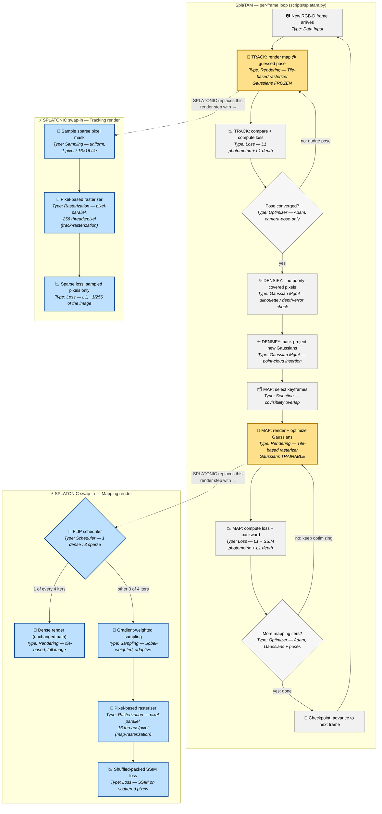

# SplaTAM Pipeline — with SPLATONIC's Modified Blocks Highlighted

This diagram shows SplaTAM's real per-frame loop (Track → Densify → Map, repeated for
every incoming RGB-D frame). The two **yellow** blocks are the ones SPLATONIC actually
replaces. Next to each highlighted block is a **small blue side-flow** showing exactly
what SPLATONIC swaps in at that point — this is *not* a full second pipeline, just the
local replacement for that one block.

Every node is labeled with its **type** (Rendering / Loss / Sampling / Rasterization /
Gaussian Mgmt / Selection / Optimizer / Scheduler) so you can see at a glance what kind
of work each step is doing.

**Legend:** 🟡 yellow = the exact block SPLATONIC modifies. 🔵 blue = SPLATONIC's
replacement logic for that block, shown as its own tiny flow. Everything in grey is
untouched by SPLATONIC.

---

## Step-by-step explanation

### The main SplaTAM loop (grey + yellow blocks)

1. **New RGB-D frame arrives** *(Data Input)* — a color photo + a depth photo land
   from the camera.
2. **TRACK: render map at guessed pose** *(Rendering — Tile-based rasterizer, 🟡
   modified)* — freeze every Gaussian in the map exactly as-is, and render what the
   camera *should* see if it were at the currently-guessed position. SplaTAM's
   original renderer does this by dropping every Gaussian into all the 16×16-pixel
   screen tiles it overlaps, sorting each tile's Gaussians by depth, and blending
   them front-to-back — for the *entire* image.
3. **TRACK: compare + compute loss** *(Loss — L1 photometric + L1 depth)* — compare
   the rendered picture to the real photo pixel-by-pixel and turn the mismatch into a
   single loss number.
4. **Pose converged?** *(Optimizer — Adam, camera-pose-only)* — if the loss is still
   too high, nudge the guessed camera pose a little (gradient descent) and go back to
   step 2. This loop runs many times per frame.
5. **DENSIFY: find poorly-covered pixels** *(Gaussian Mgmt)* — now that the pose for
   this frame is settled, check which pixels the current map explains badly (low
   "silhouette" confidence, or a big depth mismatch).
6. **DENSIFY: back-project new Gaussians** *(Gaussian Mgmt)* — turn those
   poorly-explained pixels into brand-new Gaussian blobs and add them to the map.
7. **MAP: select keyframes** *(Selection — covisibility overlap)* — pick a handful of
   past frames that overlap with what the camera currently sees, to optimize against.
8. **MAP: render + optimize Gaussians** *(Rendering — Tile-based rasterizer, 🟡
   modified)* — this time let the Gaussians themselves change (position, size, color,
   opacity) instead of freezing them, rendering each selected keyframe the same
   tile-based way as step 2.
9. **MAP: compute loss + backward** *(Loss — L1 + SSIM + L1 depth)* — compare
   rendered vs. real for all the selected keyframes and backpropagate into the
   Gaussian parameters.
10. **More mapping iters?** *(Optimizer — Adam, Gaussians + poses)* — repeat steps
    8–9 for a fixed number of iterations, then checkpoint and move to the next frame.

### SPLATONIC's swap-in for Tracking (blue box, replaces step 2)

1. **Sample sparse pixel mask** *(Sampling — uniform)* — instead of using every
   pixel, pick exactly one random pixel from each 16×16 tile across the image (about
   1/256th of all pixels), once per frame, reused for every tracking iteration that
   frame.
2. **Pixel-based rasterizer** *(Rasterization — pixel-parallel, `track-rasterization`)*
   — a rebuilt CUDA renderer that, instead of organizing work by *tile*, organizes it
   by *sampled pixel*: each Gaussian is stamped directly onto only the sampled pixels
   it covers (no more "duplicate into every tile" step), sorted by pixel instead of
   tile, and rendered with 256 GPU threads cooperating on a single pixel at a time.
3. **Sparse loss, sampled pixels only** *(Loss — L1)* — the same L1 comparison as
   before, just computed over the sparse sample instead of the whole image.

### SPLATONIC's swap-in for Mapping (blue box, replaces step 8)

1. **FLIP scheduler** *(Scheduler)* — decide, per iteration, whether this pass will
   be dense (full image) or sparse. The ratio is 1 dense : 3 sparse.
2. **Dense render** *(Rendering — unchanged)* — every 4th iteration, just do the
   original full tile-based render, to keep the whole optimization anchored to the
   complete picture.
3. **Gradient-weighted sampling** *(Sampling — Sobel-weighted)* — for the other 3 of
   4 iterations, pick sample pixels with probability proportional to local image
   gradient (edges get more samples, flat blank areas get fewer, since flat areas
   carry almost no shape information).
4. **Pixel-based rasterizer** *(Rasterization — pixel-parallel, `map-rasterization`)*
   — the same pixel-indexed rendering redesign as tracking's, but tuned for mapping's
   different pixel-count/Gaussian-count trade-off (16 threads per pixel instead of
   256, since mapping samples more pixels but usually shorter per-pixel Gaussian
   lists).
5. **Shuffled-packed SSIM loss** *(Loss — SSIM on scattered pixels)* — standard SSIM
   needs a normal rectangular image, which scattered sparse pixels aren't. This step
   shuffles a copy of the sampled pixels, glues the original and shuffled versions
   into a synthetic fake "image," and runs ordinary SSIM on that — close enough to
   keep the structural-similarity loss usable in the sparse setting.

**Why this is worth doing:** tracking's inner loop (steps 2–4) runs many times per
frame just to solve for 6 pose numbers, and mapping's inner loop (steps 8–10) runs
many times per frame to reshape the Gaussians. Both were paying for a full-image
render every single time. SPLATONIC's replacements do a small, well-spread fraction
of that rendering work per iteration (occasionally topped up with a full dense render
for mapping, so quality doesn't drift), cutting the GPU cost of the two
highest-frequency steps in the whole SLAM loop.
