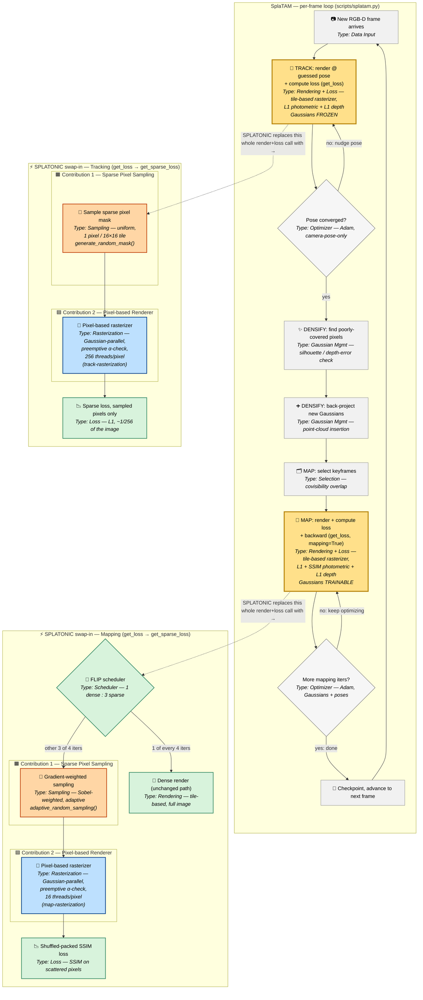

# SplaTAM Pipeline — with SPLATONIC's Modified Blocks Highlighted

This diagram shows SplaTAM's real per-frame loop (Track → Densify → Map, repeated for
every incoming RGB-D frame). The two **yellow** blocks are the ones SPLATONIC actually
replaces. Next to each highlighted block is a **small blue side-flow** showing exactly
what SPLATONIC swaps in at that point — this is *not* a full second pipeline, just the
local replacement for that one block.

Every node is labeled with its **type** (Rendering / Loss / Sampling / Rasterization /
Gaussian Mgmt / Selection / Optimizer / Scheduler) so you can see at a glance what kind
of work each step is doing.

SPLATONIC's software side has exactly **two** engineering contributions (a third,
a custom hardware pipeline, is architecture/RTL work with no software artifact to
diagram here — see the discussion below). Both blue side-flows are broken into two
explicitly labeled sub-boxes so you can see which nodes belong to which contribution:
🟧 **Contribution 1 — adaptive sparse pixel sampling**, and 🟦 **Contribution 2 — the
pixel-based rendering pipeline**. The loss/scheduling nodes (green) are supporting
glue needed to make 1 and 2 work together, not a headline contribution themselves.

**Legend:** 🟡 yellow = the exact block SPLATONIC modifies — note this is a **render +
loss** block, not render alone: in the real code `get_loss()`/`get_sparse_loss()` is one
function that does both. 🟧 orange = **Contribution 1: adaptive sparse pixel sampling**
(`mask_utils.py` — uniform per-tile sampling for tracking, gradient-weighted sampling
for mapping). 🟦 blue = **Contribution 2: the pixel-based rendering pipeline**
(`track-rasterization`/`map-rasterization` — Gaussian-parallel rendering + preemptive
α-checking, replacing SplaTAM's tile-based rasterizer). 🟩 green = supporting glue
(FLIP scheduling, sparse-aware loss math) needed to wire 1 and 2 together — not a
headline contribution on its own. Everything in grey is untouched by SPLATONIC.
*(SPLATONIC's paper has a third contribution — a custom pipelined hardware
architecture — but that's RTL/accelerator design with no corresponding node in this
software pipeline, so it isn't drawn here.)*

---

## Step-by-step explanation

### The main SplaTAM loop (grey + yellow blocks)

1. **New RGB-D frame arrives** *(Data Input)* — a color photo + a depth photo land
   from the camera.
2. **TRACK: render @ guessed pose + compute loss** *(Rendering + Loss — tile-based
   rasterizer, 🟡 modified)* — this is a single function call (`get_loss()` in
   SplaTAM) that both renders and scores the render, not two separate steps: freeze
   every Gaussian in the map exactly as-is, render what the camera *should* see at the
   currently-guessed position (dropping every Gaussian into all the 16×16-pixel screen
   tiles it overlaps, sorting each tile's Gaussians by depth, blending front-to-back
   for the *entire* image), then immediately compare that render to the real photo
   pixel-by-pixel (L1 photometric + L1 depth) and turn the mismatch into a single loss
   number.
3. **Pose converged?** *(Optimizer — Adam, camera-pose-only)* — if the loss is still
   too high, nudge the guessed camera pose a little (gradient descent) and go back to
   step 2. This loop runs many times per frame.
4. **DENSIFY: find poorly-covered pixels** *(Gaussian Mgmt)* — now that the pose for
   this frame is settled, check which pixels the current map explains badly (low
   "silhouette" confidence, or a big depth mismatch).
5. **DENSIFY: back-project new Gaussians** *(Gaussian Mgmt)* — turn those
   poorly-explained pixels into brand-new Gaussian blobs and add them to the map.
6. **MAP: select keyframes** *(Selection — covisibility overlap)* — pick a handful of
   past frames that overlap with what the camera currently sees, to optimize against.
7. **MAP: render + compute loss + backward** *(Rendering + Loss — tile-based
   rasterizer, 🟡 modified)* — again one function call (`get_loss()` with
   `mapping=True`): let the Gaussians themselves change (position, size, color,
   opacity) instead of freezing them, render each selected keyframe the same
   tile-based way as step 2, compare rendered vs. real (L1 + SSIM + L1 depth), and
   backpropagate straight into the Gaussian parameters.
8. **More mapping iters?** *(Optimizer — Adam, Gaussians + poses)* — repeat step 7
   for a fixed number of iterations, then checkpoint and move to the next frame.

### SPLATONIC's swap-in for Tracking (blue box, replaces all of step 2 — render *and* loss)

1. **🟧 Contribution 1 — Sample sparse pixel mask** *(Sampling — uniform)* — instead
   of using every pixel, pick exactly one random pixel from each 16×16 tile across the
   image (about 1/256th of all pixels), once per frame, reused for every tracking
   iteration that frame.
2. **🟦 Contribution 2 — Pixel-based rasterizer** *(Rasterization — pixel-parallel,
   `track-rasterization`)* — a rebuilt CUDA renderer that, instead of organizing work
   by *tile*, organizes it by *sampled pixel*: each Gaussian is stamped directly onto
   only the sampled pixels it covers (no more "duplicate into every tile" step),
   sorted by pixel instead of tile, and rendered with 256 GPU threads cooperating on a
   single pixel at a time. This is also where preemptive α-checking lives — a Gaussian
   whose contribution to a pixel is provably below the visibility threshold is culled
   before a sort key is even emitted for it.
3. **🟩 Glue — Sparse loss, sampled pixels only** *(Loss — L1)* — the same L1 comparison as
   before, just computed over the sparse sample instead of the whole image. This is
   also part of the swap — `get_sparse_loss()` replaces `get_loss()` entirely, both
   its render call and its loss math.

### SPLATONIC's swap-in for Mapping (blue box, replaces all of step 7 — render *and* loss)

1. **🟩 Glue — FLIP scheduler** *(Scheduler)* — decide, per iteration, whether this
   pass will be dense (full image) or sparse. The ratio is 1 dense : 3 sparse.
2. **🟩 Glue — Dense render** *(Rendering — unchanged)* — every 4th iteration, just do
   the original full tile-based render, to keep the whole optimization anchored to the
   complete picture. (Not a SPLATONIC contribution — this is stock SplaTAM rendering,
   kept as a periodic anchor.)
3. **🟧 Contribution 1 — Gradient-weighted sampling** *(Sampling — Sobel-weighted)* —
   for the other 3 of 4 iterations, pick sample pixels with probability proportional
   to local image gradient (edges get more samples, flat blank areas get fewer, since
   flat areas carry almost no shape information).
4. **🟦 Contribution 2 — Pixel-based rasterizer** *(Rasterization — pixel-parallel,
   `map-rasterization`)* — the same pixel-indexed rendering redesign as tracking's
   (including preemptive α-checking), but tuned for mapping's different
   pixel-count/Gaussian-count trade-off (16 threads per pixel instead of 256, since
   mapping samples more pixels but usually shorter per-pixel Gaussian lists).
5. **🟩 Glue — Shuffled-packed SSIM loss** *(Loss — SSIM on scattered pixels)* — standard SSIM
   needs a normal rectangular image, which scattered sparse pixels aren't. This step
   shuffles a copy of the sampled pixels, glues the original and shuffled versions
   into a synthetic fake "image," and runs ordinary SSIM on that — close enough to
   keep the structural-similarity loss usable in the sparse setting.

**Why this is worth doing:** tracking's inner loop (steps 2–4) runs many times per
frame just to solve for 6 pose numbers, and mapping's inner loop (steps 8–10) runs
many times per frame to reshape the Gaussians. Both were paying for a full-image
render every single time. SPLATONIC's replacements do a small, well-spread fraction
of that rendering work per iteration (occasionally topped up with a full dense render
for mapping, so quality doesn't drift), cutting the GPU cost of the two
highest-frequency steps in the whole SLAM loop.
